<div align="center">


# MADAK SPICES · مذاق لتوابل

**Premium Arabic-first (RTL) spice store for Android, plus a separate Admin app (لوحة التحكم).**

Kotlin · Jetpack Compose · Material 3 · MVVM · Hilt · Room · Retrofit · Coil · Navigation Compose

</div>

---

## Contents

1. [Overview](#overview)
2. [Screenshots](#screenshots)
3. [Features](#features)
4. [Tech stack](#tech-stack)
5. [Project structure](#project-structure)
6. [Local development](#local-development)
7. [Android Studio setup](#android-studio-setup)
8. [GitHub Actions workflow](#github-actions-workflow)
9. [Downloading the APK](#downloading-the-apk)
10. [Release builds & secrets](#release-builds--secrets)
11. [Admin architecture & security](#admin-architecture--security)
12. [Backend integration (Firebase / Supabase)](#backend-integration-firebase--supabase)
13. [Store configuration checklist](#store-configuration-checklist)

---

## Overview

The repository builds **two APKs** from one Gradle project:

| App | Module | Application ID | Purpose |
|---|---|---|---|
| **Madak Spices** | `:app` | `com.madak.spices` | Customer shopping app (Arabic RTL default, French available) |
| **Madak Admin** | `:admin` | `com.madak.spices.admin` | Back-office app: products, orders, inventory, statistics… |

Both apps share the same data layer (`:core:data`) and design system (`:core:designsystem`), including
the official Madak logo and the **motion-graphics splash with sound design**.

> **The catalogue starts empty.** No demo products, prices, offers or orders are shipped. The store
> is created with three category shelves (توابل أساسية، خلطات مذاق، أعشاب) and the owner adds the
> real products from the Admin app.

## Screenshots

These screens were rendered on the JVM by the automated UI smoke tests (`AppSmokeTest`, `AdminSmokeTest`).

| Splash (motion) | | | |
|---|---|---|---|
| 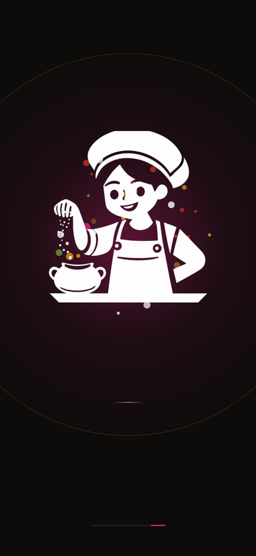 | 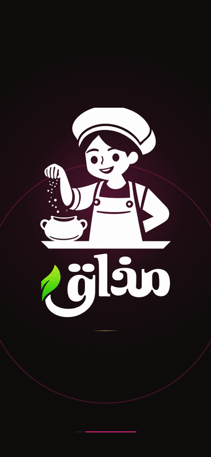 | 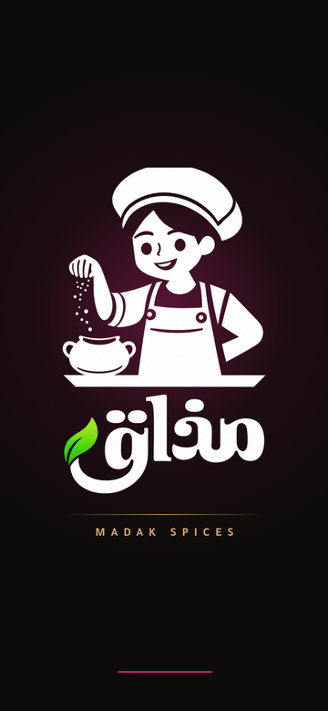 |  |

| Empty store | With a product | ماذا تطبخ اليوم؟ | Product |
|---|---|---|---|
| 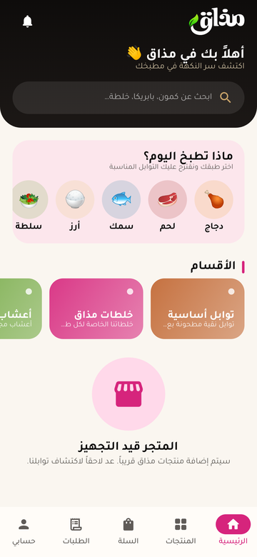 | 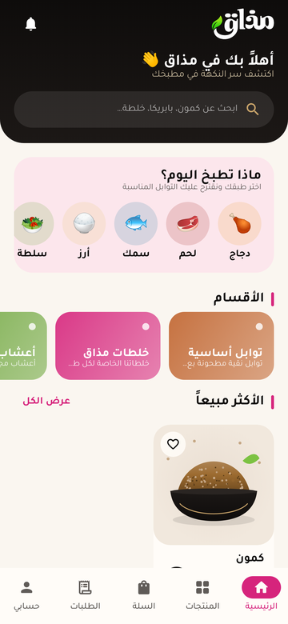 | 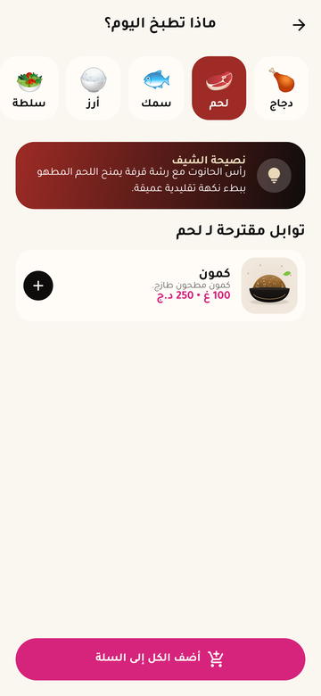 | 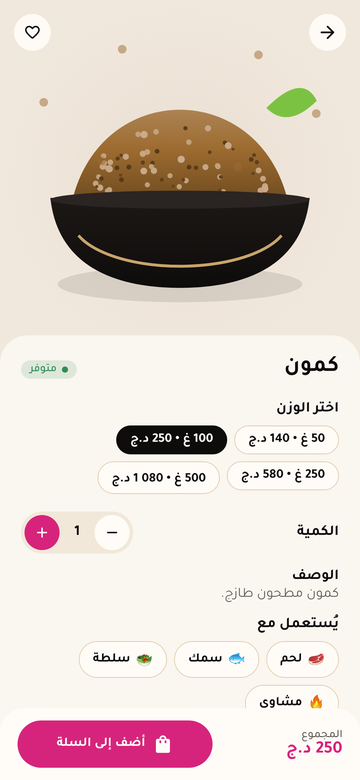 |

| Cart | Checkout | Tracking | Profile |
|---|---|---|---|
| 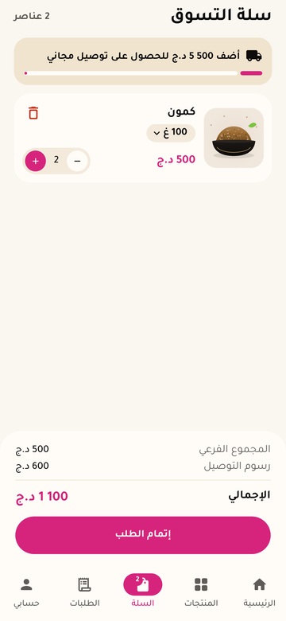 | 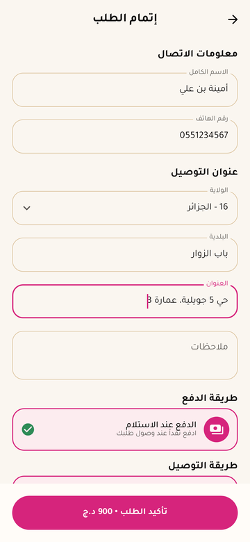 | 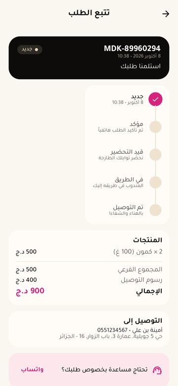 | 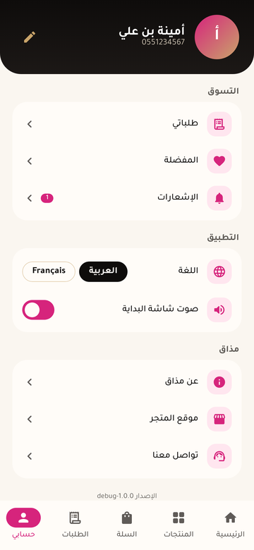 |

| Admin – first-run setup | Admin – dashboard | Admin – navigation |
|---|---|---|
| 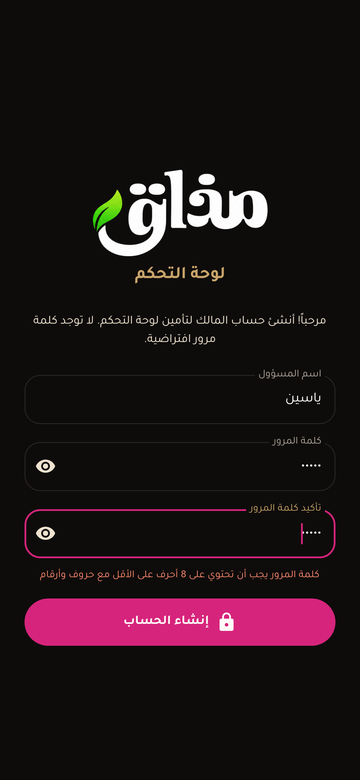 | 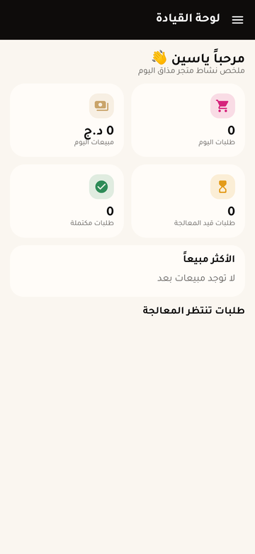 | 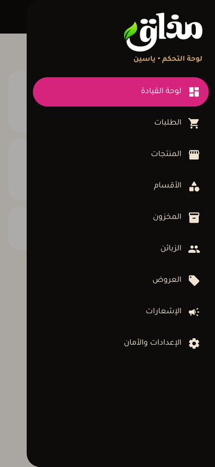 |

## Features

### Customer app (`:app`)
- **Motion-graphics splash** built from the original logo layers (chef, wordmark, leaf), never redrawn or
  distorted: golden ring and magenta glow, the chef pops in, a spice-particle burst, grains fall from the
  chef's hand into the pot, the wordmark is revealed right-to-left, the leaf grows from its stem, a light
  shimmer sweeps across, then the *MADAK SPICES* tagline.
  It's synced to a **synthesized sound design** (`res/raw/madak_intro.wav`: whoosh → boom → sprinkle →
  thump → leaf pluck → sparkle → warm chord) with a haptic tick when the wordmark lands. The sound is muted
  when the phone is in silent/vibrate mode and can be turned off in *حسابي*. Tap to skip.
- Onboarding (3 animated pages)
- Home: greeting, search, offers carousel (shown only when offers exist), *ماذا تطبخ اليوم؟*, categories,
  best sellers, featured products, pull-to-refresh, skeleton loading, empty-store state
- Product catalogue with category filters and sorting, search with debounce, favorites
- Product details with **50 g / 100 g / 250 g / 500 g** variants, stock status, quantity, DZD pricing
- **ماذا تطبخ اليوم؟**: دجاج، لحم، سمك، أرز، سلطة، شوربة، مشاوي. Recommendations are matched by keyword
  against the real catalogue (Arabic and French names/tags), with a chef tip and *أضف إلى السلة* /
  *أضف الكل إلى السلة*
- Cart: add, remove (with undo), quantity, **change weight**, subtotal, delivery fee, total, free-delivery progress
- Checkout: الاسم الكامل، رقم الهاتف (Algerian validation)، الولاية (58 wilayas, searchable sheet)، البلدية،
  العنوان، ملاحظات · **الدفع عند الاستلام** · **توصيل للمنزل**
- Order confirmation (animated), orders list, **order tracking timeline**
  (NEW → CONFIRMED → PREPARING → OUT_FOR_DELIVERY → DELIVERED / CANCELLED); cancel while NEW
- In-app notifications center + Android system notifications
- Profile, language switch **العربية / Français**, About Madak, store location, contact (TikTok, and
  WhatsApp/phone/Instagram/e-mail once configured)
- Animations: fade/scale/slide navigation, animated cart badge, bounce clicks, haptic feedback
- Fully **offline**: Room is the single source of truth, and network failures never crash the app

### Admin app (`:admin`)
- Same motion splash with a *لوحة التحكم* badge
- **First-run owner setup**: no default or hardcoded credentials; strong passphrase policy
- Dashboard: **today's orders, today's sales, pending orders, completed orders, best-selling products**,
  low-stock alert
- Orders (filter by status, details, call customer, move along the lifecycle, cancel with stock restore)
- Products (add/edit; prices for 50/250/500 g derived from the 100 g price; activate/deactivate)
- Categories, Inventory (±1 / +10, low-stock filter), Customers, Offers, Notifications broadcast
- Settings & security (change passphrase, logout)

## Tech stack

| Area | Library |
|---|---|
| Language / build | Kotlin 2.2, Gradle 8.14 (Kotlin DSL + version catalog), AGP 8.13 |
| UI | Jetpack Compose (BOM 2025.10), Material 3, Navigation Compose, core-splashscreen |
| Architecture | MVVM, unidirectional state with `StateFlow`, Coroutines/Flow |
| DI | Hilt (KSP) |
| Persistence | Room 2.7 (KSP), DataStore Preferences |
| Network | Retrofit 2 + OkHttp + Gson (optional backend) |
| Images | Real product photos bundled offline (matched by product name, CC BY/BY-SA, see `docs/brand/PHOTO_CREDITS.md`) + Coil for image URLs |
| Tests | JUnit 4, Robolectric + Compose UI test (end-to-end smoke tests on the JVM) |
| SDK | `minSdk 24`, `compileSdk/targetSdk 36` |
| Font | Tajawal (SIL OFL, `docs/brand/Tajawal-OFL.txt`) |

## Project structure

```
.
├── app/                         # Customer app (com.madak.spices)
│   └── src/main/java/com/madak/spices/
│       ├── MainActivity.kt      # locale (ar default) + edge-to-edge + splash API
│       ├── navigation/          # NavHost, bottom bar (الرئيسية، المنتجات، السلة، الطلبات، حسابي)
│       ├── feature/             # splash, home, catalog, cook, cart, orders, profile (screens + ViewModels)
│       └── ui/                  # shared UI, formatting, intents, notifications
├── admin/                       # Admin app (com.madak.spices.admin)
│   └── src/main/java/com/madak/spices/admin/
│       ├── auth/                # PBKDF2 hashing, owner account, roles/permissions, lockout
│       ├── feature/             # dashboard, orders, catalogue, inventory, customers, offers, notifications
│       └── ui/                  # shell (drawer), shared admin UI
├── core/
│   ├── data/                    # Room entities/DAOs/DB, repositories, models, Retrofit API, Hilt modules
│   └── designsystem/            # theme, components, logo assets, MadakMotionSplash, intro sound
├── docs/
│   ├── brand/                   # original logo, icon, font licence, sound generator script
│   └── screenshots/
├── .github/workflows/android.yml
└── gradle/libs.versions.toml
```

**Room models:** User, Category, Product, ProductVariant, Cart, CartItem, Order, OrderItem,
OrderStatusEvent, Address, Favorite, Notification, Offer.

## Local development

Requirements: **JDK 17+** and the **Android SDK** (platform 36, build-tools 36).

```bash
git clone https://github.com/ya3in3335/Mad1.git
cd Mad1
echo "sdk.dir=$HOME/Android/Sdk" > local.properties   # path to your SDK (not committed)

./gradlew testDebugUnitTest    # unit tests + Robolectric UI smoke tests
./gradlew assembleDebug        # builds both APKs
```

Outputs:
- `app/build/outputs/apk/debug/madak-spices-debug.apk`
- `admin/build/outputs/apk/debug/madak-admin-debug.apk`

The UI smoke tests also write screenshots to `app/build/outputs/screenshots/` and `admin/build/outputs/screenshots/`.

## Android Studio setup

1. *File → Open…* and select the repository root.
2. Let Gradle sync (Android Studio uses the bundled JDK 17/21).
3. Pick the **app** or **admin** run configuration and press ▶.
4. The debug builds use the `.debug` application-id suffix, so they can be installed next to release builds.

## GitHub Actions workflow

`.github/workflows/android.yml` runs on **every push** (including `main`), on pull requests to `main`,
and manually (*workflow_dispatch*):

1. Checkout → JDK 17 (Temurin) → Android SDK → Gradle (with dependency/build cache)
2. `./gradlew testDebugUnitTest`: unit tests and UI smoke tests (**fails the build on any failure**)
3. `./gradlew assembleDebug`
4. Uploads artifacts:
   - **`madak-spices-debug-apk`**: customer app
   - **`madak-admin-debug-apk`**: admin app
   - `test-reports`: HTML reports and smoke-test screenshots

A second job builds **signed release APKs** on pushes to `main`, but only when the signing secrets exist.
Without them it is skipped, and the debug build always works.

No step hides failures (no `|| true`), and no test is disabled.

## Downloading the APK

1. Open the repository on GitHub → **Actions** → **Android CI**.
2. Click the latest successful run.
3. In **Artifacts**, download **madak-spices-debug-apk** (and/or **madak-admin-debug-apk**).
4. Unzip, copy the `.apk` to the phone and install it (allow *Install unknown apps*).

## Release builds & secrets

Signing keys are **never committed** (`*.jks`, `*.keystore`, `keystore.properties` are git-ignored).
Release signing is configured only when all values are provided as environment variables.

Create a keystore once:

```bash
keytool -genkeypair -v -keystore madak-release.jks -alias madak -keyalg RSA -keysize 4096 -validity 10000
base64 -w0 madak-release.jks > keystore.b64     # macOS: base64 -i madak-release.jks
```

Add these **GitHub Secrets** (*Settings → Secrets and variables → Actions*):

| Secret | Value |
|---|---|
| `KEYSTORE_BASE64` | content of `keystore.b64` |
| `KEYSTORE_PASSWORD` | keystore password |
| `KEY_ALIAS` | key alias (e.g. `madak`) |
| `KEY_PASSWORD` | key password |

Local signed build:

```bash
export MADAK_KEYSTORE_PATH=/path/to/madak-release.jks KEYSTORE_PASSWORD=… KEY_ALIAS=madak KEY_PASSWORD=…
./gradlew assembleRelease
```

Release builds use R8 minification and resource shrinking.

## Admin architecture & security

- **Separate APK** (`com.madak.spices.admin`) so customers never receive back-office code.
- **No hardcoded credentials.** On first launch the owner creates a passphrase (≥ 8 characters, letters
  and digits). Only a salted **PBKDF2** hash is stored (HMAC-SHA256, 120 000 iterations; SHA-1 variant on
  API 24–25 where SHA-256 is unavailable).
- Lock-out after 5 failed attempts (30 s, doubling, max 15 min); auto-lock after 5 minutes in background.
- `FLAG_SECURE` (no screenshots or recents preview); backups and device transfer disabled.
- **Role-based permissions** (`OWNER`, `MANAGER`, `STAFF` × products, categories, orders, customers,
  inventory, offers, notifications, statistics, settings), ready to be mapped to server-side claims.

> ⚠️ **Important: shared data needs a backend.** Each Android app has its own private database, so
> products created in the Admin app, and orders placed in the customer app, stay on the device where they
> were created. To run the real store (owner adds products → customers see them → owner receives orders),
> connect a shared backend as described below. `MadakApi` and `RemoteConfig` already define the contract.

## Backend integration (Firebase / Supabase)

The app is offline-first: Room stays the source of truth and a backend synchronises it.

1. Set `MADAK_API_BASE_URL` in `core/data/build.gradle.kts` (remote calls are disabled while it points to
   the placeholder `.example` domain).
2. Implement the endpoints declared in `core/data/.../remote/MadakApi.kt`:
   `GET v1/catalog` (products, variants, prices, stock) and `POST v1/orders`.
3. Admin writes become API calls in `AdminRepository`, `OfferRepository` and `NotificationRepository`.

**Supabase:** tables mirroring the Room entities; Row-Level Security with an `admin_role` claim; Supabase
Auth for the admin login (replace `AdminAuthRepository`); Edge Functions for `v1/catalog` / `v1/orders`;
Storage for product photos (`ProductEntity.imageUrl`, loaded with Coil).

**Firebase:** Firestore collections for the same entities; Firebase Auth with custom claims for roles;
Cloud Functions for order lifecycle notifications; **FCM** for push (the `orders` notification channel
already exists); Firebase Storage for images. Add `google-services.json` locally/through CI secrets
(it is git-ignored).

## Store configuration checklist

Store details live in `core/data/src/main/java/com/madak/spices/data/model/StoreInfo.kt`.
Current values come from the official TikTok account [@madak.spices](https://www.tiktok.com/@madak.spices)
(*Madak Spices-مذاق للتوابل*): TikTok link, slogan, and location near the M Suite hotel in Dar El Beïda, Algiers.

Phone and WhatsApp: **+213 664 71 70 29** (provided by the store owner).
Instagram, e-mail and opening hours are not published yet, so they are left empty and their buttons are
hidden; filling them in makes the buttons appear automatically.
Delivery fees and the free-delivery threshold are in `Pricing.kt`.

---

<div align="center">مذاق لتوابل — سرّ النكهة في مطبخك 🌿</div>

## Promo video

`docs/promo/make_promo.py` renders a 25 s vertical (1080×1920) motion-graphics ad from the real logo layers
and real app screens, with an original synthesized soundtrack:

```bash
./gradlew :app:testDebugUnitTest -PmadakAd=true --tests "*AdScreenshotsTest"   # app screens with an illustrative catalogue
python3 docs/promo/make_promo.py . app/build/outputs/screenshots/ad madak-promo.mp4
```
